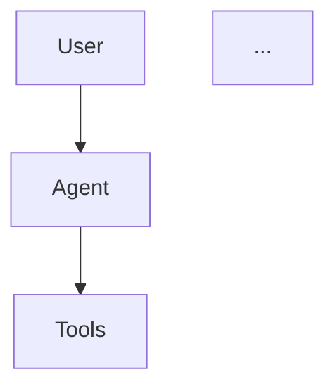

# Bilibili Video Summarizer — B站学习视频总结工具

[](LICENSE)
[](https://www.python.org/downloads/)

> 从 B 站学习视频中获取字幕，通过 LLM 自动生成结构化的高质量学习笔记。内置可插拔的总结策略，你也可以按自己的需求定制。

**为什么做这个**：B站有大量优质的技术/学习类视频，但看完之后要把知识整理成笔记非常耗时。这个工具把这件事自动化了：字幕提取 → LLM 总结 → 结构化笔记，直接放进你的知识库（Obsidian、Notion 等都行）。

---

## 功能特性

- 🎬 **字幕获取** — 通过 B站 API 拉取 AI/人工字幕，自动选择最佳语言
- 🎙️ **Whisper 降级** — 视频没有字幕时，自动下载音频用本地 Whisper 转录（覆盖 100% 视频）
- 🤖 **LLM 总结** — 把字幕转成结构化的学习笔记，不是简单摘要
- 🔌 **可插拔策略** — 内置 `quick`（快速）和 `deep`（深度研究）两种策略，也支持[自己写](#自定义策略)
- 📝 **Obsidian 兼容** — 输出带 frontmatter、标签、来源链接的 Markdown
- 🌐 **LLM 无关** — 支持 OpenAI、Proma Cloud、DeepSeek、Ollama 等任何兼容 OpenAI 接口的 API
- ⚙️ **零硬编码** — 所有配置通过 `.env` 文件管理，不会误提交敏感信息

## 快速开始

### 1. 安装

```bash
git clone https://github.com/YOUR_USERNAME/bilibili-video-summarizer.git
cd bilibili-video-summarizer
pip install -r requirements.txt
```

### 2. 配置

```bash
cp .env.example .env
```

编辑 `.env`，填入必要信息：

```ini
# B站登录凭证（获取方法见下方）
BILI_SESSDATA=你的_SESSDATA
BILI_JCT=你的_bili_jct
BILI_DEDE_USER_ID=你的用户ID

# LLM API（兼容 OpenAI 接口的任何服务）
LLM_BASE_URL=https://api.openai.com/v1
LLM_API_KEY=sk-你的API-Key
LLM_MODEL=gpt-4o
```

<details>
<summary><b>怎么获取 B站 Cookie？</b></summary>

1. 浏览器登录 [bilibili.com](https://www.bilibili.com)
2. 按 F12 → **Application**（应用程序）→ **Cookies** → `https://www.bilibili.com`
3. 复制 `SESSDATA`、`bili_jct`、`DedeUserID` 三项的值
</details>

### 3. 使用

```bash
# 快速总结（一次 LLM 调用，约 30 秒）
bilibili-summarize --bvid BV1LUJP6REUf --strategy quick

# 深度研究（三阶段流水线，约 2-3 分钟）
bilibili-summarize --url "https://www.bilibili.com/video/BV1LUJP6REUf" --strategy deep

# 无字幕视频，自动降级 Whisper 语音识别
bilibili-summarize --bvid BV1xx --strategy deep --whisper-fallback

# 指定输出目录
bilibili-summarize --bvid BV1xx --strategy deep -o ./我的笔记
```

## 策略说明

| 策略 | 说明 | 速度 | 质量 | LLM 调用次数 |
|------|------|------|------|:----------:|
| `quick` | 一次性 LLM 总结 | ~30s | ⭐⭐⭐ | 1 |
| `deep` | 三阶段：研究员 → 笔记撰写 → 审阅修正 | ~2-3min | ⭐⭐⭐⭐⭐ | 3-4 |

### `deep` 策略工作流程

```
┌──────────────┐     ┌──────────────┐     ┌──────────────┐     ┌──────────────┐
│  字幕获取     │ ──▶ │  第一階段：   │ ──▶ │  第二階段：   │ ──▶ │  第三階段：   │
│              │     │  研究员       │     │  笔记撰写员   │     │  审阅员       │
│              │     │              │     │              │     │              │
│ • B站 API    │     │ 分析字幕全文， │     │ 基于研究简报  │     │ 五个维度评分：│
│   字幕获取    │     │ 提取关键概念、 │     │ 撰写结构化    │     │ 准确性/完整性 │
│ • Whisper    │     │ 论点、案例，  │     │ Markdown     │     │ /结构/清晰度  │
│   语音降级    │     │ 产出研究简报  │     │ 笔记         │     │ /可操作性     │
└──────────────┘     └──────────────┘     └──────────────┘     └──────┬───────┘
                                                                      │
                                                              ┌───────▼───────┐
                                                              │  最终笔记      │
                                                              │  (.md 文件)   │
                                                              └───────────────┘
```

### 三阶段详解

**第一阶段 — 研究员**：通读字幕全文，提取所有技术概念、核心论点、实践案例、知识盲区，产出结构化的"研究简报"。这一步决定了笔记质量的上限。

**第二阶段 — 笔记撰写员**：根据研究简报，撰写详尽的学习笔记，包含 Mermaid 图表（架构图/流程图）、代码示例、方案对比表格。笔记包含 7 个标准章节：概述 → 核心概念 → 关键论点 → 架构/工作流 → 实践指南 → 要点总结 → 个人反思。

**第三阶段 — 审阅员**：严格审查笔记质量，5 个维度逐项打分（1-5 分），发现问题直接修正。审阅结论有三种：通过、有条件通过（修正后保存）、不通过（重写）。

## 自定义策略

如果你对内置的总结方式不满意，可以自己写策略。只需要继承 `BaseStrategy` 并实现 `summarize()` 方法：

```python
from bilibili_summarizer.strategies.base import BaseStrategy, VideoContext, SummaryResult
from bilibili_summarizer.llm import call_llm

class MyStrategy(BaseStrategy):
    name = "my_strategy"
    description = "我的自定义总结方式"

    def summarize(self, ctx: VideoContext) -> SummaryResult:
        # 这里写你自己的逻辑，想调几次 LLM 都行
        note = call_llm(
            system_prompt="把这段视频字幕总结成一份教程。",
            user_prompt=ctx.subtitle_text,
        )
        return SummaryResult(markdown=note)
```

然后使用：

```bash
BILI_SUMMARIZE_STRATEGY=/path/to/my_strategy.py \
    bilibili-summarize --bvid BV1xx --strategy custom
```

完整模板和进阶示例（含多阶段策略）见 [`examples/custom_strategy.py`](examples/custom_strategy.py)。

## 输出示例

`deep` 策略生成的笔记长这样：

```markdown
---
tags: [learning, Agent, LLM]
created: 2026-07-08
source: https://www.bilibili.com/video/BV1xx...
author: 某某UP主
review_score: 21/25
review_verdict: pass
---

# 用 LangChain 构建 AI Agent

## 1. 概述
...

## 2. 核心概念
### 2.1 Agent 类型
...

## 3. 架构

...
```

## 项目结构

```
bilibili-video-summarizer/
├── bilibili_summarizer/          # 主包
│   ├── __init__.py
│   ├── cli.py                    # CLI 入口
│   ├── config.py                 # .env 配置加载
│   ├── llm.py                    # LLM API 调用（OpenAI 兼容）
│   ├── subtitle/                 # 字幕获取子模块
│   │   ├── __init__.py
│   │   ├── fetcher.py            #   B站 API 字幕获取
│   │   └── whisper_fallback.py   #   Whisper 语音识别降级
│   └── strategies/               # 可插拔总结策略
│       ├── __init__.py           #   策略注册表
│       ├── base.py               #   基类 BaseStrategy
│       ├── quick.py              #   快速总结策略
│       └── deep.py               #   三阶段深度研究策略
├── examples/
│   └── custom_strategy.py        # 自定义策略模板 + 进阶示例
├── .env.example                  # 配置模板
├── requirements.txt
├── pyproject.toml
├── LICENSE
└── README.md
```

## 依赖

| 包 | 必装 | 用途 |
|---|---|---|
| `requests` | ✅ | B站 API 请求 |
| `httpx` | ✅ | LLM API 请求 |
| `python-dotenv` | ✅ | `.env` 配置加载 |
| `faster-whisper` | ❌ 可选 | Whisper 语音识别降级 |
| `yt-dlp` | ❌ 可选 | 音频下载备用方案 |

## 配置参考

| 环境变量 | 必填 | 说明 |
|---------|:--:|------|
| `BILI_SESSDATA` | ✅ | B站登录 Cookie |
| `BILI_JCT` | ✅ | B站 CSRF Token |
| `BILI_DEDE_USER_ID` | ✅ | B站用户 ID |
| `LLM_BASE_URL` | ✅ | LLM API 地址（OpenAI 兼容） |
| `LLM_API_KEY` | ✅ | LLM API 密钥 |
| `LLM_MODEL` | 否 | 模型名（默认 gpt-4o） |
| `LLM_EXTRA_HEADERS` | 否 | 自定义 HTTP 头（JSON 字符串） |
| `OUTPUT_DIR` | 否 | 笔记输出目录（默认 ./output） |
| `NOTE_LANGUAGE` | 否 | 笔记语言（默认 zh） |

## 常见问题

**Q: 一定要填 B站 Cookie 吗？**
A: 是的，B站字幕接口需要登录态才能访问。

**Q: 视频没有字幕怎么办？**
A: 加 `--whisper-fallback` 参数，会自动下载音频用本地 Whisper 模型转录。需要先 `pip install faster-whisper`。

**Q: 能用本地模型吗（Ollama 等）？**
A: 可以。在 `.env` 里把 `LLM_BASE_URL` 设成 `http://localhost:11434/v1`，`LLM_MODEL` 设成你的模型名（如 `llama3`）即可。

**Q: 能用 Proma Cloud 吗？**
A: 可以。把 `LLM_BASE_URL` 和 `LLM_API_KEY` 换成 Proma Cloud 的地址和 Key。

**Q: 怎么自己写总结策略？**
A: 复制 `examples/custom_strategy.py`，改里面的 prompt 和逻辑，然后设置环境变量 `BILI_SUMMARIZE_STRATEGY` 指向你的文件即可。详见[自定义策略](#自定义策略)。

## 许可协议

MIT — 详见 [LICENSE](LICENSE)。
