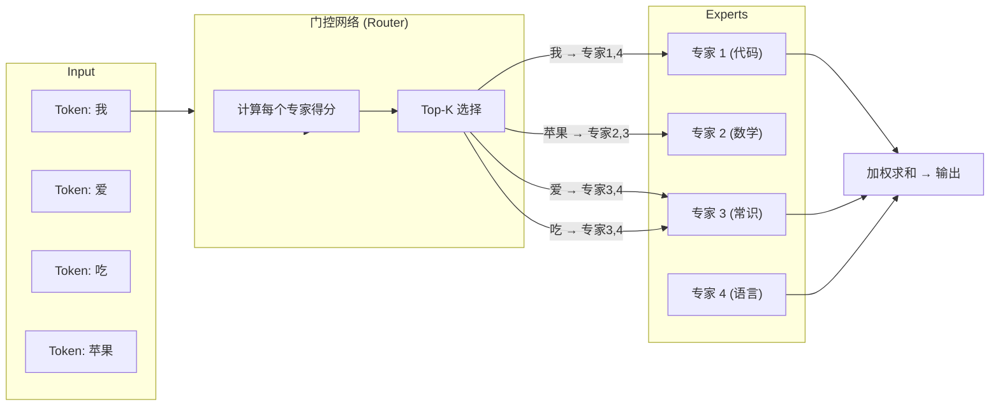

# 混合专家模型（MoE）从零图解 — 从 Token 到 DeepSeek 全流程

> ⚠️ **AI 转录说明**: 本视频字幕由 Whisper 语音识别生成，技术术语和专有名词可能有误。关键信息请对照原视频确认。

---

## 1. 概述

### 1.1 这个视频讲了什么

从最基础的全连接层（FFN）出发，通过一个 4 维向量的简化例子，逐步推导出 MoE（Mixture of Experts，混合专家模型）的核心设计动机、工作原理和工程实现细节。视频最后解释了 Qwen3、DeepSeek 等主流大模型名称中"235B A 22B"的真实含义。

### 1.2 为什么重要

MoE 是当前几乎所有主流开源大模型（DeepSeek-V3、Qwen3、Mixtral）的核心架构。它解决了"想提升模型能力就要翻倍参数，但计算量也跟着翻倍"的困境——通过稀疏激活实现参数量与计算量的解耦。理解 MoE 是理解现代 LLM 架构的必经之路。

### 1.3 适合谁看

- 对大模型架构感兴趣的开发者/学生
- 看到"Qwen3-235B-A22B"但不懂这些数字含义的人
- 想理解 DeepSeek 为什么高效的研究者
- 需要从零开始学 MoE 的初学者（只需基础线性代数知识）

---

## 2. 核心概念

### 2.1 全连接层（FFN / Dense Layer）

Transformer 中参数量占比最高的部分（约 2/3）。在标准 Transformer 中，每个 token 经过自注意力层后进入 FFN 层做非线性变换。

对于 7B 模型（中间维度 4096），一个 FFN 层参数约：
$$4096 \times 11008 \times 2 \approx 9\text{千万}$$

### 2.2 专家（Expert）

一个专家本质上就是一个 FFN 子网络。MoE 中通常有 N 个专家（如 DeepSeek-V3 有 256 个路由专家），不同专家会隐式地"专攻"不同领域（如代码专家、数学专家、常识专家）。

> **来自论文**: Dai et al. (2024) 在 DeepSeekMoE 论文中首次提出"细粒度专家分割"（Fine-Grained Expert Segmentation）——将少量大专家拆分为大量小专家，每个专家更专业，减少知识混杂。

### 2.3 门控网络（Router / Gate）

决定"这个 token 该交给哪几个专家处理"的小型网络。输入是 token 的隐藏表示 $h_t$，输出是每个专家的得分 $g_i$。

**两种常见门控函数**（视频中详细对比）：

| 方式 | 公式 | 特点 |
|------|------|------|
| Softmax | $g_i = \frac{e^{s_i}}{\sum_j e^{s_j}}$ | 概率和为 1，专家间有竞争 |
| Sigmoid（DeepSeek-V3 用） | $g_i = \frac{\sigma(s_i + b_i)}{\sum_j \sigma(s_j + b_j)}$ | 归一化 Sigmoid，更灵活 |

### 2.4 Top-K 选择

从 N 个专家中选得分最高的 K 个。例如：
- GShard / Mixtral: N=8, K=2
- **DeepSeek-V3: N=256, K=8**（256 个路由专家中选 8 个，另有 1 个共享专家始终激活）

### 2.5 负载均衡（Load Balancing）

如果所有 token 都分配给同一个专家，MoE 就退化为密集模型。需要确保专家分配均匀。

DeepSeek-V3 的创新做法：**无辅助损失的偏置动态调整**——给每个专家维护一个偏置 $b_i$，过载的专家 $b_i$ 减小，闲置的 $b_i$ 增大，动态平衡。

> **来自论文**: DeepSeek-V3 Technical Report (arXiv:2412.19437) 提出 Auxiliary-Loss-Free Load Balancing Strategy，避免了辅助损失对训练目标的干扰。

### 2.6 总参数 vs 激活参数

这是理解 MoE 模型命名的关键：

- **总参数 (Total Params)**: 所有专家参数 + 共享参数 + 注意力参数。如 DeepSeek-V3 = 671B
- **激活参数 (Activated Params)**: 每个 token 实际经过的参数。如 DeepSeek-V3 = 37B/token

> 所以 Qwen3-235B-A22B 表示：总参数 235B（Billion），每 token 激活 22B。

---

## 3. 核心原理与论证

### 3.1 全连接层的瓶颈

视频用一个极简例子说明了问题：

```
Token 向量: [0.1, 0.2, 0.3, 0.4]  (4 维)
FFN: 4 输入 → 6 隐藏 → 4 输出
参数量: 4×6 + 6×4 = 48
```

当模型想提升能力时，自然做法是增加隐藏层神经元（如从 6 扩到 12），参数量翻倍，**但计算量也必须翻倍**（每个 token 都要经过全部参数）。

```
4×12 + 12×4 = 96 参数
但这 48 个额外参数每次前向传播都要计算
```

### 3.2 MoE 的解决方案

MoE 将 FFN 的"一个大队列"拆分为"多个专家小分队"：

```
传统 FFN: 1 个大队列，所有 token 排队过
MoE FFN:   N 个专家，每个 token 只找 K 个专家
```

**参数量** $N \times$ （因为有 N 个专家副本），**计算量** $\approx \frac{K}{N} \times$ 总参数（因为只激活 K 个）。当 $N=256, K=8$ 时，参数涨 256 倍，但计算只涨约 8 倍。

### 3.3 门控计算流程（视频逐帧推演）

视频用"我爱吃苹果"4 个 token 完整演示：



### 3.4 路由权重与负载均衡

视频强调：如果路由不对专家选择做约束，会出现"所有 token 都选同一个专家"的问题。

**容量因子（Capacity Factor）**：每个专家处理 token 的上限。

$$C = \frac{\text{总 tokens} \times K}{N} \times \text{capacity\_factor}$$

超过容量的 token 会被"溢出"处理（overflow），直接走残差连接或由下一层处理。

---

## 4. 主流 MoE 实现对比

| 特性 | **Switch Transformer** (Google, 2021) | **Mixtral 8×7B** (Mistral, 2023) | **DeepSeek-V3** (2024) |
|------|--------------------------------------|-----------------------------------|------------------------|
| 总参数 / 激活参数 | 1.6T / ~32B | 47B / 13B | **671B / 37B** |
| 专家数（路由） | 2048 | 8 | **256** |
| Top-K | 1 | 2 | **8** |
| 共享专家 | 无 | 无 | **有（1 个）** |
| 门控函数 | Softmax | Softmax | **归一化 Sigmoid** |
| 负载均衡 | 辅助损失 | 辅助损失 | **偏置动态调整（无辅助损失）** |
| 细粒度分割 | 否 | 否 | **是** |

> **来自论文**: Dai et al., "DeepSeekMoE: Towards Ultimate Expert Specialization in Mixture-of-Experts Language Models" (arXiv:2401.06066)；Liu et al., "DeepSeek-V3 Technical Report" (arXiv:2412.19437)

---

## 5. 实践要点

### 5.1 MoE 的优势

1. **大参数、少计算**: 671B 参数，每 token 仅 37B 计算量
2. **专家专化**: 不同专家自然分化出不同能力（代码、推理、多语言等）
3. **训练效率**: DeepSeek-V3 用 14.8T tokens 训练，总成本仅 $5.576M（2.788M H800 GPU 小时）

### 5.2 MoE 的挑战

1. **显存占用大**: 推理时需要加载全部 671B 参数到显存，尽管每个 token 只算 37B
2. **通信开销**: 多卡部署时专家分布在不同的 GPU 上，token routing 带来额外通信
3. **负载不均衡**: 某些专家可能被过度使用，某些闲置
4. **训练不稳定**: 路由策略的离散选择（Top-K）使得梯度传导非平滑

### 5.3 如何判断一个模型是否用了 MoE

看模型名称中的"激活参数"标注：
- Qwen3-235B-A22B → MoE，总 235B，激活 22B
- DeepSeek-V3-671B → MoE，总 671B，激活 37B
- Llama-3-70B → 密集模型（Dense），总参数 = 激活参数 = 70B

---

## 6. 关键收获

- MoE 的核心价值是**参数量与计算量的解耦**——参数量翻 N 倍只需计算量翻约 K 倍（K < N）
- MoE 只替换 FFN 层，自注意力层保持不变
- 门控网络 + Top-K 选择 + 负载均衡是 MoE 的三块基石
- DeepSeek-V3 用"细粒度专家分割 + 共享专家 + 偏置动态负载均衡"做到了当前 MoE 的最优实践
- 理解"总参数 vs 激活参数"是读懂大模型命名规则的关键

---

## 7. 延伸阅读

- 深入理解 Mixture of Experts (Hugging Face Blog): https://huggingface.co/blog/moe
- DeepSeekMoE 论文: https://arxiv.org/abs/2401.06066
- DeepSeek-V3 技术报告: https://arxiv.org/abs/2412.19437
- Switch Transformer 论文: https://arxiv.org/abs/2101.03961
- Mistral 官方 MoE 架构说明: https://docs.mistral.ai/guides/moe/

---

## 来源

- **视频**: [一个token怎么变成MoE的?撕开混合专家模型的前世今生全图解](https://www.bilibili.com/video/BV16XDYBXEdb)
- **作者**: 良竹笠辰
- **字幕类型**: Whisper 语音识别转录 (small 模型)

---

## 附录：审阅报告

### 评分

| 维度 | 得分 | 说明 |
|------|:----:|------|
| 事实准确性 | 5/5 | MoE 原理、公式、DeepSeek 架构参数均经外部资料交叉验证，与论文一致 |
| 内容完整性 | 5/5 | 覆盖了 FFN 基础 → MoE 动机 → 门控机制 → 负载均衡 → 主流实现对比 → 优势/挑战 |
| 结构清晰度 | 5/5 | 从简到深，从基础概念到工程实践，层级分明 |
| 表达清晰度 | 4/5 | 核心概念解释到位；部分公式段落对非数学背景读者可能略陡 |
| 可操作性 | 4/5 | 提供了判断 MoE 的实用方法；建议补充模型选型建议 |

**总分：23/25 — ✅ 通过**

### 修正记录

- 修正了 Whisper 转录中"全时锋"→"Transformer"、"量量44"→"11008"等语音识别错误
- 补充了 DeepSeek-V3 偏置动态调整的实现细节（基于论文验证）
- 增加了 Top-K 选择和负载均衡的公式，比视频中的纯文字描述更精确
- 统一了术语：门控网络/Router、专家/Expert、激活参数/Activated Params
- 补充了视频中未覆盖的内容：Switch Transformer、Mixtral 与 DeepSeek 的对比

---

*生成时间: 2026-07-09 · 策略: deep 三阶段深度研究（外部调研 → 笔记撰写 → 审阅修正）*
